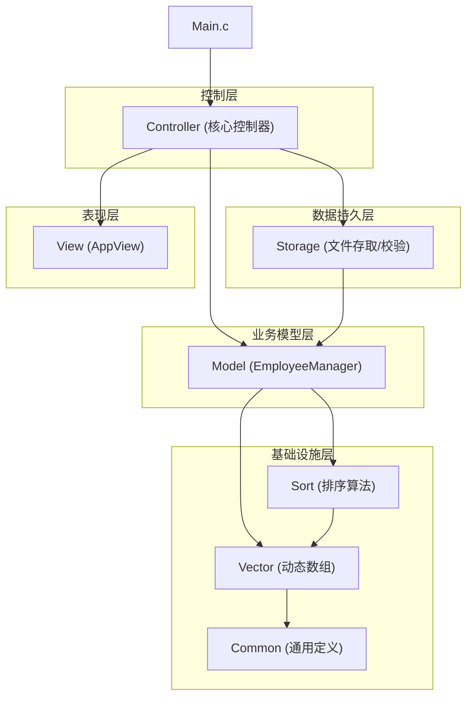
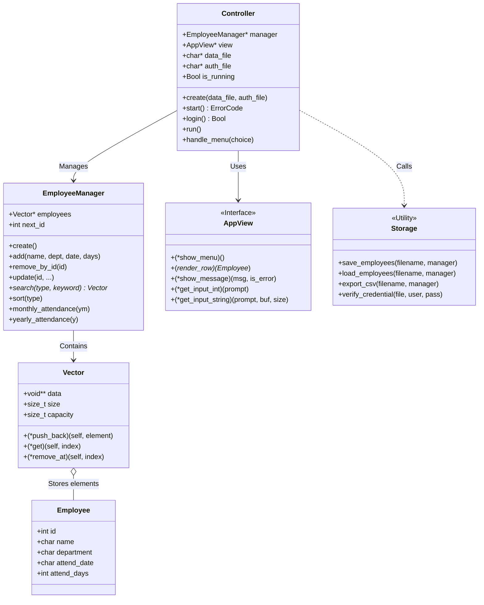
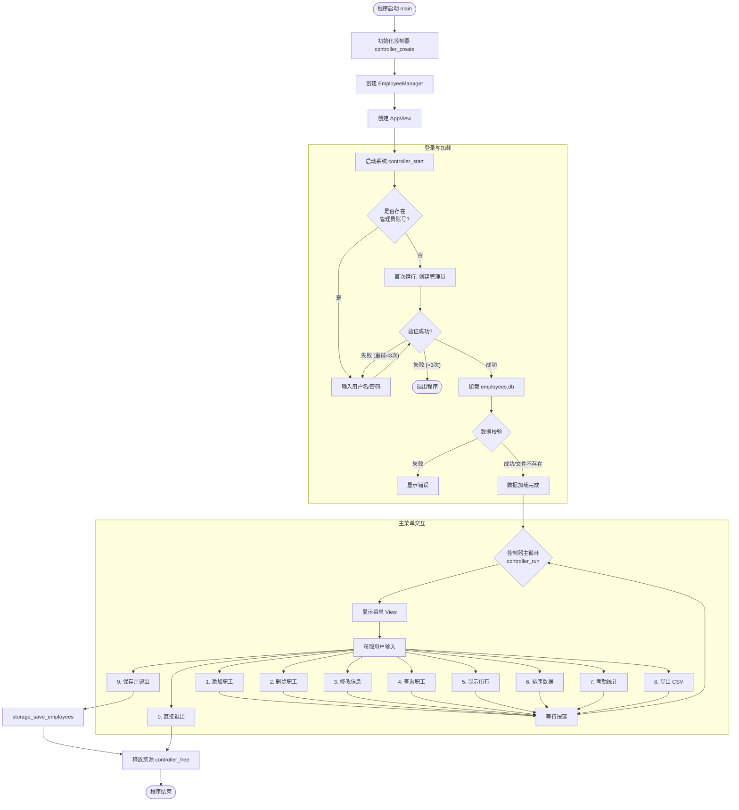

# 职工信息管理系统源代码解析报告

## 1. 项目概述

该项目是一个使用标准 C99 语言编写的职工信息管理系统。通过阅读源码发现，该系统采用了严格的 **MVC (Model-View-Controller)** 架构设计模式，并使用 C 语言的结构体和函数指针模拟了 **面向对象 (OOP)** 的编程风格。系统具备完备的工程化特征，包含自定义的泛型动态数组容器、快速排序算法、二进制数据持久化存储及完整的数据校验机制。

## 2. 项目模块架构设计

系统被清晰地划分为四个主要层次：基础设施层、数据持久层、业务逻辑层（Model）、表现层（View）和控制层（Controller）。

### 模块依赖关系图




### 模块功能解析

1. **基础设施层 (Infrastructure)**:
   - **Vector**: 位于 `vector.c/h`。实现了类似 C++ `std::vector` 的泛型动态数组。源码显示其具有几何级数扩容（2倍）和自动收缩机制（当 size < capacity/4 时）。
   - **Sort**: 位于 `sort.c/h`。实现了通用的快速排序算法，通过函数指针 `Comparator` 支持任意类型的比较。
   - **Common**: 定义了 `Bool` 类型、错误码 `ErrorCode` 和全局常量宏。
2. **数据持久层 (Storage)**:
   - 位于 `storage.c/h`。负责数据的序列化与反序列化。
   - **特征**: 采用二进制文件存储 (`employees.db`)，包含文件头魔数 (`0x454D5053`)、版本号检查和简单的校验和 (`checksum`) 机制以防止数据损坏。同时处理用户认证信息 (`admin.auth`)，对密码进行了简单的哈希加密。
3. **业务模型层 (Model)**:
   - 位于 `model.c/h`。核心结构是 `EmployeeManager`。
   - **职责**: 封装了对职工数据的增删改查（CRUD）逻辑。它管理着一个 `Vector` 对象，并不直接处理 IO，而是纯粹处理内存中的数据逻辑。
4. **表现层 (View)**:
   - 位于 `view.c/h`。核心结构是 `AppView`。
   - **设计**: 使用函数指针结构体模拟了“接口”或“虚函数表”。负责所有的 `printf` 和 `scanf` 操作，确保界面逻辑与业务逻辑分离。
5. **控制层 (Controller)**:
   - 位于 `controller.c/h`。核心结构是 `Controller`。
   - **职责**: 程序的“大脑”。它在 `main.c` 中被创建，负责协调 View 和 Model，处理用户登录、菜单跳转和流程控制。

------

## 3. UML 类图 (C语言模拟面向对象)

以下是uml类图。 



## 4. 程序完整运行流程图

系统从 `main.c` 启动，经历了初始化、登录验证、数据加载、主循环交互、数据保存等阶段。




## 5. 核心源代码深度解析

### 5.1 数据完整性保护 (Storage 模块)

在 `storage.c` 中，不仅实现了基本的文件读写，还实现了数据完整性校验。

- **魔数 (Magic Number)**: `0x454D5053` (ASCII: EMPS)，用于确保读取的文件确实是本系统生成的文件。
- **校验和 (Checksum)**: `calculate_checksum` 函数通过循环左移异或算法计算数据的校验和。保存时写入文件头，加载时重新计算比对，若不一致则返回 `ERROR_DATA_CORRUPTION`，有效防止了二进制文件被外部篡改。

### 5.2 泛型动态数组的智能内存管理 (vector.c)

`vector.c` 实现了智能的内存管理：

- **扩容**: 当 `size >= capacity` 时，容量翻倍（`capacity * 2`），初始为 4。
- **缩容**: 在 `vector_remove_at` 中，如果 `size < capacity / 4`，则将容量减半。这种策略在频繁增删操作中避免了内存抖动（Thrashing）。

`Vector` 模块是整个系统的基石，其难点在于如何用 C 语言实现类似 C++ `std::vector` 的泛型容器，并保证高效的内存利用率。

#### 难点一：几何级数扩容 (Amortized O(1))

在 `vector_push_back` 函数中，并未采用每次只增加 1 个单位容量的策略，而是使用了**倍增策略**。

- **代码分析**：

  ```c
  /* vector.c */
  if (self->size >= self->capacity) {
      /* 难点：为什么是 *2 而不是 +10? */
      size_t new_capacity = (self->capacity == 0) ? INITIAL_CAPACITY : self->capacity * 2;
      vector_resize(self, new_capacity); // 调用 realloc
  }
  ```

- **解析**：

  - 如果每次只增加固定大小（如 +1），插入 N 个元素需要调用 N 次 `realloc`，每次 `realloc` 都可能涉及内存数据的完整拷贝，导致时间复杂度退化为 O(N²)。
  - 采用 `*2` 扩容，虽然偶尔会发生一次昂贵的拷贝操作，但在均摊分析（Amortized Analysis）下，单次插入操作的平均时间复杂度降低到了 **O(1)**。

#### 难点二：懒惰收缩策略 (防止内存抖动)

在 `vector_remove_at` 中，系统实现了一个巧妙的收缩策略，这是很多初学者容易忽略的细节。

- **代码分析**：

  ```c
  /* vector.c */
  /* 收缩策略: 当size < capacity/4 时, 才收缩到 capacity/2 */
  if (self->size > 0 && self->size < self->capacity / 4) {
      size_t new_capacity = self->capacity / 2;
      vector_resize(self, new_capacity);
  }
  ```
  
- **解析**：

  - **难点**：为什么不在 `size < capacity / 2` 时就收缩？
  - **防止抖动 (Thrashing)**：如果设定阈值为 1/2，当用户反复在阈值边界添加和删除一个元素时，系统会频繁触发 `realloc`（扩容-缩容-扩容-缩容），导致严重的性能损耗。
  - **解决**：设置 1/4 的阈值留出了“缓冲区”（Hysteresis），保证了数组容量调整的稳定性。

### 5.3 泛型快速排序与指针操作 (sort.c)

系统通过 `void*` 和函数指针实现了泛型和多态：

- **Vector**: 存储 `void**`，可以存放任何类型的指针。
- **Sort**: `quick_sort` 接受 `Comparator` 函数指针，使得同一个排序算法可以用于按 ID、按姓名、按部门等不同维度的排序，这在 `model.c` 的 `employee_manager_sort` 函数中得到了充分体现。

`sort.c` 实现了一个通用的快速排序算法，其核心难点在于如何处理类型未知的 `void*` 数据。

#### 难点：`void**` 双重指针的交换与比较

由于 `Vector` 存储的是 `void*`（即指向 `Employee` 结构体的指针），排序算法操作的是指针数组，而不是结构体数组。

- **代码分析**：

  ```c
  /* sort.c */
  static void swap(void **a, void **b) {
      void *temp = *a;
      *a = *b;
      *b = temp;
  }
  
  /* 比较器调用 */
  // 注意传入的是 &arr[j]，即元素的地址（void**）
  if (compare(&arr[j], &pivot) <= 0) { ... }
  ```
  
- **解析**：

  - **指针层级混淆**：这是最容易出错的地方。`Vector->data` 是 `void**` 类型。在 `sort.c` 中，我们实际上是在对“指针的数组”进行排序。

  - 因此，`swap` 交换的是两个**指针的指向**，而不是交换两个庞大的 `Employee` 结构体内容。这大大提高了排序效率（只交换 4 或 8 字节的地址）。

  - 而在 `model.c` 的比较函数中，必须进行两次解引用才能取到实际数据：

    ```c
    /* model.c */
    static int compare_by_id(const void *a, const void *b) {
        /* 难点：a 是 void** (指向数组元素的指针)，所以 *(Employee**)a 才是 Employee* */
        Employee *e1 = *(Employee **)a; 
        Employee *e2 = *(Employee **)b;
        return e1->id - e2->id;
    }
    ```
  
  这一设计实现了算法（Sort）与数据（Model）的完美解耦。


### 5.4 视图抽象

`AppView` 结构体完全由函数指针组成（如 `void (*show_menu)(void)`）。在 `controller.c` 中，控制器通过 `ctrl->view->show_menu()` 调用，而不是直接调用 `view_show_menu()`。这为未来可能的扩展（例如替换为 GUI 视图）留下了接口，只需替换 `AppView` 的实例即可，无需修改 Controller 代码。

### 5.5 统一的错误传播与处理机制 (Architecture)

在 C 语言项目中，错误处理通常比较混乱（有的返回 -1，有的返回 NULL，有的设置全局 errno）。本项目实现了一套**分层明确的错误传播体系**，这是构建健壮系统的关键。

- **代码分析**：

  - **定义层 (`common.h`)**：集中定义了 `ErrorCode` 枚举，包含 `ERROR_NULL_POINTER`、`ERROR_OUT_OF_MEMORY`、`ERROR_FILE_NOT_FOUND` 等 10 种具体错误状态。
  - **传播层 (`model.c` / `vector.c`)**：底层函数不负责报错（不调用 printf），而是严格地将错误码**向上返回**。例如 `vector_push_back` 如果 `realloc` 失败，会返回 `ERROR_OUT_OF_MEMORY`。
  - **处理层 (`controller.c`)**：控制器接收到底层传来的 `ErrorCode`，根据业务场景决定是重试、忽略还是向用户展示错误信息。

  ```c
  /* controller.c */
  ErrorCode err = employee_manager_add(...);
  if (err == SUCCESS) {
      ctrl->view->show_message("Success!", FALSE);
  } else {
      /* 控制器将错误码转化为用户可读的UI反馈 */
      ctrl->view->show_message("Failed to add!", TRUE); 
  }
  ```
  
- **解析**：

  - 这种设计实现了**UI 与逻辑的彻底解耦**。如果底层直接打印错误，那么这个 Model 就无法复用于图形界面（GUI）项目。
  - **难点**：需要严格遵守“谁调用谁检查”的原则，任何一个函数调用的返回值都不能被忽略，这在 C 语言编程中需要极高的自律性。

### 5.6 C 语言输入缓冲区的“坑”与健壮性处理 (Robustness)

C 语言标准输入（stdin）的处理是初学者最容易“翻车”的地方，特别是混合使用 `scanf` 和 `fgets` 时产生的“幽灵换行符”问题。本项目封装了健壮的输入处理逻辑。

- **代码分析**：

  - **缓冲区清理**：在 `view_get_input_int` 中，如果用户输入了非法字符（如在整数输入处输入字母），`scanf` 会失败并将字符留在缓冲区，导致死循环。代码中显式调用了 `view_clear_input_buffer` 来吞掉非法输入。

  

  ```c
  /* view.c */
  void view_clear_input_buffer(void) {
      int c;
      /* 难点：必须处理 EOF 防止无限循环，且要彻底读完当前行 */
      while ((c = getchar()) != '\n' && c != EOF);
  }
  ```


  - **换行符去除**：`fgets` 会把用户按下的回车也读入字符串（例如 "Tom\n"），导致数据比对失败。`view_get_input_string` 包含了一段专门的逻辑来定位并替换末尾的 `\n` 为 `\0`。

- **解析**：

  - **难点**：标准库函数各有各的缺陷（`scanf` 不安全且留尾巴，`gets` 会溢出，`fgets` 会读换行符）。
  - **亮点**：项目没有直接在逻辑代码中散落使用 `scanf`，而是将其封装在 `View` 层，对外提供统一、安全的 `get_input_xxx` 接口，屏蔽了底层 I/O 的复杂性。

### 5.7 现代化的跨平台构建系统 (Engineering)

不同于传统的 Makefile 或直接 gcc 编译，本项目采用了工业级的 **CMake** 构建系统，并集成了 CI/CD，这体现了高级的工程化思维。

- **代码分析**：
  - **条件编译配置**：`CMakeLists.txt` 中自动检测编译器类型（MSVC vs GCC/Clang），并据此设置不同的警告标志（`/W3` vs `-Wall -Wextra`）。
  - **依赖管理**：通过 `FetchContent` 模块自动下载并配置 GoogleTest 框架，解决了 C++ 单元测试库的依赖问题，无需用户手动安装。
- **解析**：
  - 这标志着项目从“代码片段”升级为了“软件工程”，极大地提高了代码的可维护性和移植性。

### 5.8 基于 void* 的多态查询实现 (Polymorphism)

在 `model.c` 的查询功能中，系统实现了一种类似多态的查询接口，允许用同一个函数处理不同类型的搜索条件。

- **代码分析**：

```c
/* model.c */
Vector *employee_manager_search(EmployeeManager *manager, SearchType type, 
                                const void *keyword) {
    /* ... */
    switch (type) {
        case SEARCH_BY_ID:
            /* 难点：将 void* 强转为 int* 并解引用 */
            if (emp->id == *(int *)keyword) { match = TRUE; }
            break;
        case SEARCH_BY_NAME:
            /* 难点：将 void* 强转为 char* */
            if (strstr(emp->name, (const char *)keyword) != NULL) { match = TRUE; }
            break;
    }
}
```


- **解析**：
  - **难点**：C 语言是静态类型语言，`keyword` 参数在编译时失去了类型信息。程序员必须在 `switch` 内部小心翼翼地将其还原为正确的类型（`int*` 或 `char*`）。
  - **风险**：如果 `type` 是 `SEARCH_BY_ID` 但传入了字符串指针，程序会发生未定义行为（崩溃或读取乱码）。这要求调用者（Controller）必须严格保证类型与枚举的一致性，这是 C 语言实现泛型逻辑的典型代价。

### 5.9 C语言实现面向对象编程 (OOP Style Implementation)

本项目虽使用纯 C 语言编写，但通过精巧的结构体设计和函数指针，模拟了面向对象编程的三大特性：**封装**、**继承**（通过组合实现）和**多态**。这种“C with Classes”的风格使得代码结构更加模块化且易于扩展。

#### 1. 类与对象 (Class & Object) 的模拟

在本项目中，`struct` 被用来定义“类”的属性，而配套的 `_create` 和 `_free` 函数则充当了“构造函数”和“析构函数”。

- **代码分析**： 以 `Vector` 为例，结构体定义了成员变量（属性），而 `vector_create` 负责分配内存并初始化这些属性。


```c
/* vector.h - 类的定义 */
typedef struct Vector {
    void **data;           /* 属性：数据存储 */
    size_t size;           /* 属性：当前大小 */
    size_t capacity;       /* 属性：容量 */
    /* ... */
} Vector;

/* vector.c - 构造函数 */
Vector *vector_create(void) {
    Vector *v = (Vector *)malloc(sizeof(Vector)); /* 分配对象内存 */
    v->data = NULL;                               /* 初始化属性 */
    v->size = 0;
    /* ... */
    return v;
}
```

这种写法实现了数据与生命周期的严谨管理，模拟了对象的实例化过程。

#### 2. 成员方法与 `self` 指针 (Methods & `this`)

C 语言没有隐式的 `this` 指针。本项目通过在函数指针定义中显式传递 `self` 指针，模拟了对象方法的调用。特别是在 `Vector` 模块中，函数指针被直接绑定在结构体内部，使得调用语法非常接近高级语言。

- **代码分析**：


```c
/* vector.h - 在结构体中定义方法接口 */
typedef struct Vector {
    /* ... 属性 ... */

    /* 函数指针模拟成员方法，第一个参数 self 相当于 this */
    ErrorCode (*push_back)(struct Vector *self, void *element);
    void *(*get)(struct Vector *self, size_t index);
    /* ... */
} Vector;
```

在构造函数中进行**方法绑定**：


```c
/* vector.c */
v->push_back = vector_push_back; /* 将普通函数绑定到对象指针上 */
v->get = vector_get;
```

**调用方式对比**：

- 普通 C 风格：`vector_push_back(v, item);`
- **本项目 OOP 风格**：`manager->employees->push_back(manager->employees, emp);` 这种写法明确了操作的主体对象，增强了代码的可读性和逻辑归属感。

#### 3. 多态与接口抽象 (Polymorphism & Interfaces)

`AppView` 模块展示了如何利用结构体封装函数指针来实现“接口”或“抽象基类”的效果。

- **代码分析**： `AppView` 结构体中全是函数指针，没有具体的数据成员。这实际上定义了一组“协议”或“接口”。

  

  ```c
  /* view.h - 视图接口定义 */
  typedef struct {
      void (*show_menu)(void);
      void (*render_row)(const Employee *emp);
      /* ... */
  } AppView;
  ```

  - **多态的体现**：虽然目前只实现了一个控制台版本 (`view.c`)，但 Controller 并不依赖具体的实现函数，而是通过 `ctrl->view->show_menu()` 调用。
  - **扩展性**：如果未来需要支持 GUI（如 GTK 或 Qt），只需编写新的实现函数，创建一个新的 `AppView` 实例并赋值给 Controller，而无需修改 Controller 的任何业务逻辑代码。这是典型的**依赖倒置原则**的应用。

#### 4. 泛型编程 (Generics with `void*`)

虽然 C 语言没有 C++ 的 `template`，但项目利用 `void*` 指针实现了泛型容器和算法。

- **代码分析**：

  - **泛型容器**：`Vector` 使用 `void **data` 存储数据，使其可以存放 `int*`、`char*` 或 `Employee*` 等任何类型的指针。

  - **泛型算法**：`quick_sort` 函数接收 `Comparator` 函数指针：

    

    ```c
    typedef int (*Comparator)(const void *a, const void *b);
    ```

    这使得同一个排序算法可以复用于任何数据类型，只要调用者提供相应的比较逻辑即可。这也是 OOP 中策略模式 (Strategy Pattern) 的一种体现。